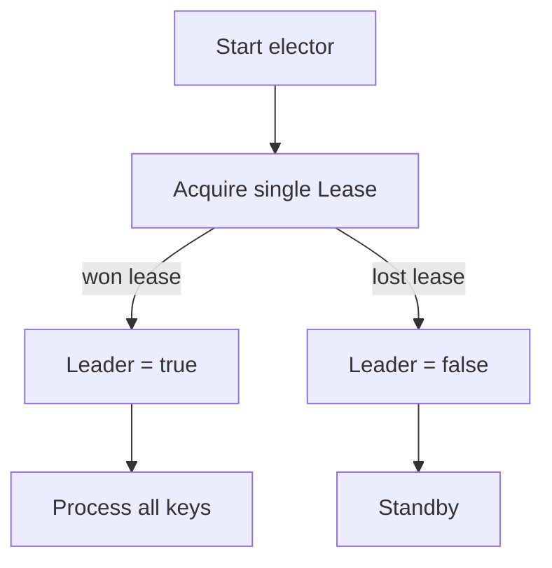
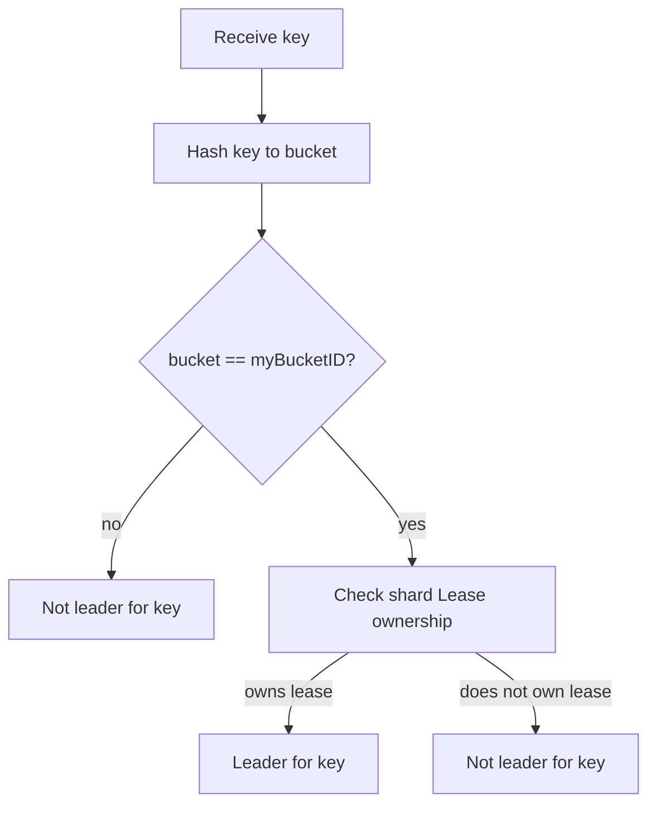
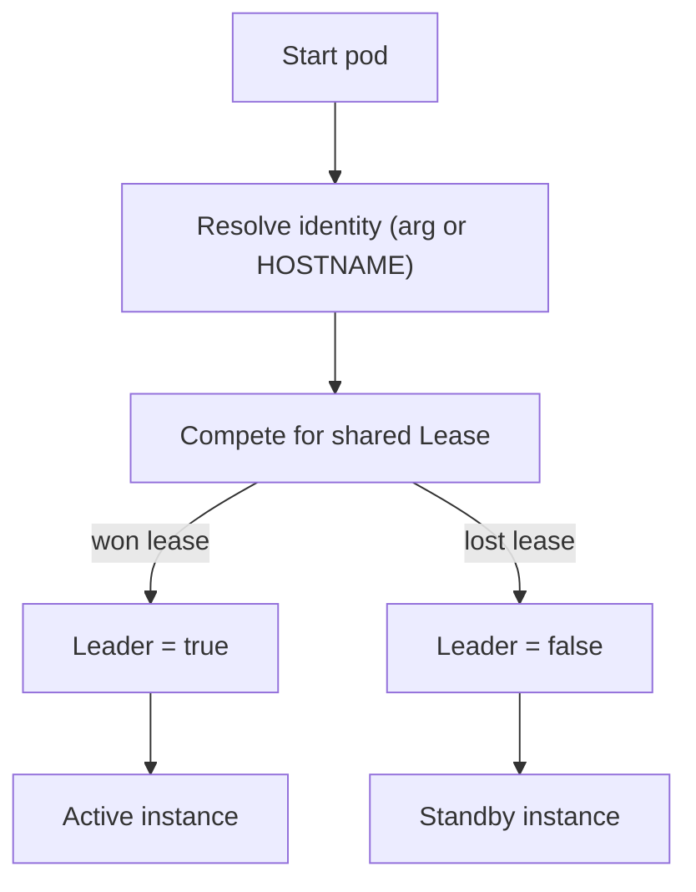

# k8s-operator-leader-election

A small Go library that demonstrates leader election patterns for Kubernetes operators.

## Strategies

### 1) Active-Passive

One instance owns a single shared lease and acts as leader for all work.

- Constructor: `NewActivePassiveElector(client, namespace, leaseName, identity)`
- Behavior: `IsLeader(key)` ignores `key` and returns lease ownership state.



### 2) Sharded

Each pod is responsible for one bucket, and leadership is elected per bucket via a bucket-specific lease.

- Constructor: `NewShardedElector(client, namespace, lockPrefix, identity, totalBuckets, myBucketID)`
- Behavior: `IsLeader(key)` is true only when:
  1. `hash(key) % totalBuckets == myBucketID`, and
  2. this instance currently owns lease `"<lockPrefix>-<myBucketID>"`.



### 3) StatefulSet (Lease-based)

StatefulSet pods still use Kubernetes Lease election for realistic failover (not ordinal-only checks).

- Constructor: `NewStatefulSetElector(client, namespace, leaseName, identity)`
- If `identity` is empty, it falls back to `HOSTNAME`.
- Behavior: `IsLeader(key)` ignores `key` and returns lease ownership state.



## Source Map

- Core implementation: `elector.go`
- Tests: `elector_test.go`
- Test runner target: `Makefile` (`run-tests`)

## Run Tests

### Recommended
```bash
make run-tests
```

This target sets `KUBEBUILDER_ASSETS` via `setup-envtest` and runs:

```bash
go test -v ./...
```

### Direct `go test` (manual envtest setup)
If you run tests directly, ensure `KUBEBUILDER_ASSETS` points to envtest binaries.
