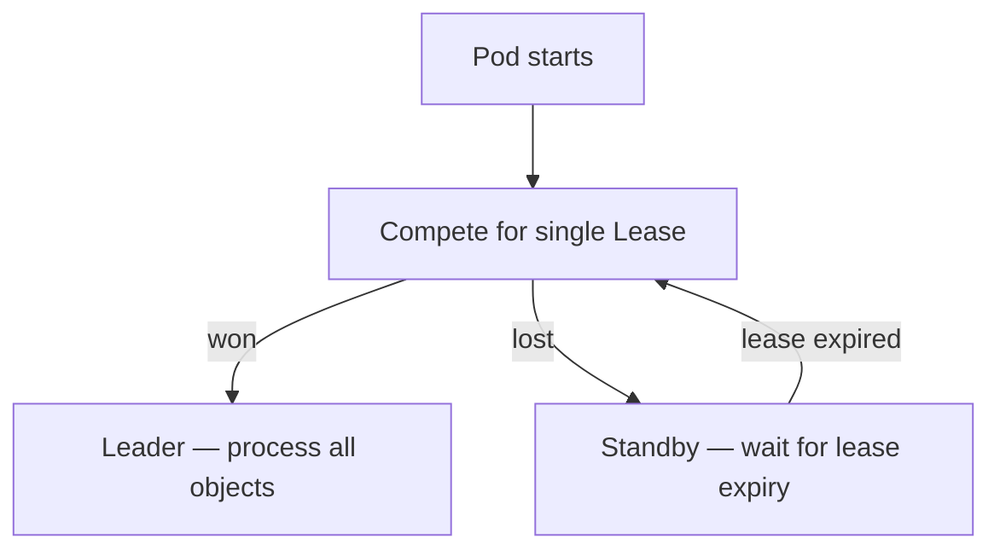
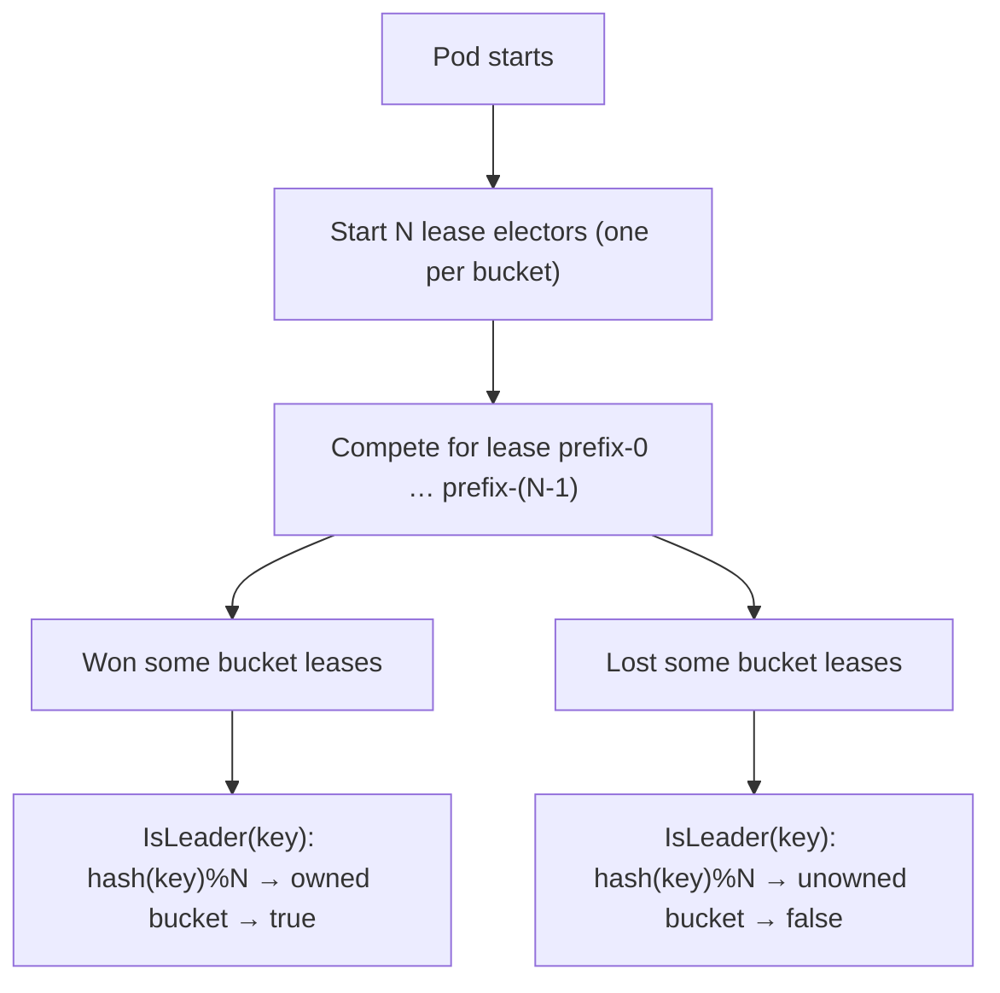
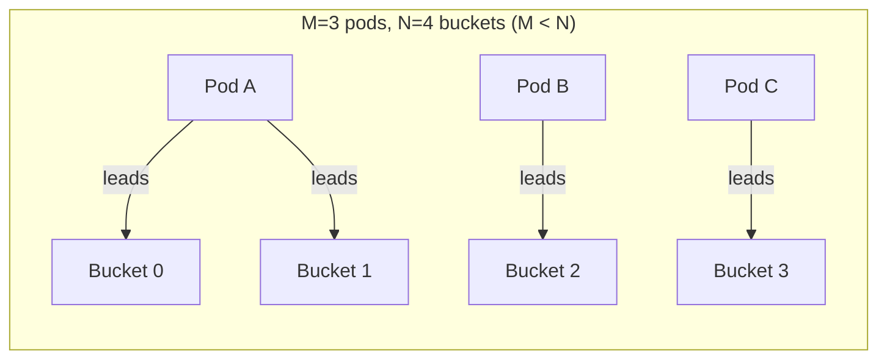
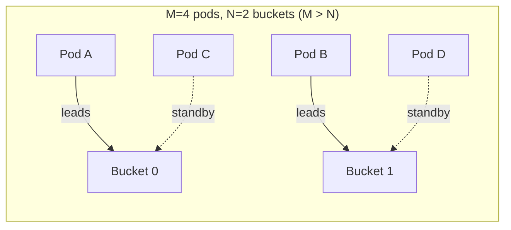
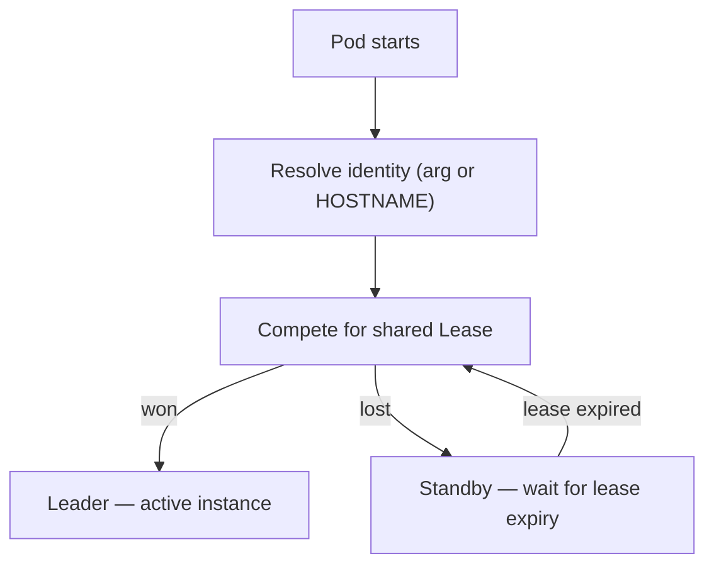

# k8s-operator-leader-election

A Go library demonstrating three leader election patterns for Kubernetes operators, with a runnable demo on a local Kind cluster.

## Strategies

### 1) Active-Passive

One instance owns a single shared Lease; all others are standby.

- **Constructor**: `NewActivePassiveElector(client, ns, leaseName, identity)`
- **`IsLeader(key)`**: ignores `key`, returns lease ownership state.



### 2) Dynamic Sharded (multi-lease)

Each pod competes for **all N bucket leases**. A pod leads bucket B when it wins lease `<prefix>-B`.

- **Constructor**: `NewDynamicShardedElector(client, ns, lockPrefix, identity, totalBuckets)`
- **`IsLeader(key)`**: `hash(key) % N → bucket`; returns `true` only if this pod holds that bucket's lease.
- **`OwnedBuckets()`**: returns the bucket IDs this pod currently leads (via `ShardOwner` interface).

#### M pods × N buckets

| Scenario | Behavior |
|----------|----------|
| **M = N** | Steady state — each pod wins ~1 bucket |
| **M < N** | Pods hold multiple buckets (e.g. 2 pods / 4 buckets → ~2 each) |
| **M > N** | At most N pods are active leaders; extras are hot-standby per bucket |

On pod crash or scale-down, leases expire and surviving pods acquire them automatically.







### 3) StatefulSet (Lease-based)

StatefulSet pods use Kubernetes Lease election for failover.

- **Constructor**: `NewStatefulSetElector(client, ns, leaseName, identity)`
- Falls back to `HOSTNAME` env var if `identity` is empty.
- **`IsLeader(key)`**: ignores `key`, returns lease ownership state.



## Source Map

| File | Purpose |
|------|---------|
| `elector.go` | Core election implementations |
| `elector_test.go` | Unit/integration tests (envtest) |
| `cmd/demo/main.go` | Minimal demo binary for Kind |
| `Dockerfile` | Multi-stage container build |
| `deploy/rbac.yaml` | ServiceAccount, Role, RoleBinding |
| `deploy/active-passive.yaml` | Deployment for active-passive |
| `deploy/sharded.yaml` | Deployment for dynamic sharding |
| `deploy/statefulset.yaml` | StatefulSet for statefulset strategy |
| `Makefile` | Build, test, and Kind cluster targets |

## Deployment Environment Variables

| Variable | Description | Default |
|----------|-------------|---------|
| `STRATEGY` | `active-passive`, `sharded`, or `statefulset` | `active-passive` |
| `NAMESPACE` | Kubernetes namespace for leases | `default` |
| `LEASE_PREFIX` | Prefix for lease object names | `leader-demo` |
| `POD_NAME` | Pod identity (set via downward API) | `unknown` |
| `TOTAL_BUCKETS` | Number of shard buckets (sharded only) | `3` |

## Run Tests

```bash
make run-tests
```

Sets `KUBEBUILDER_ASSETS` via `setup-envtest` and runs `go test -v ./...`.

## Running on Kind

### Prerequisites

- [kind](https://kind.sigs.k8s.io/)
- [kubectl](https://kubernetes.io/docs/tasks/tools/)
- [Docker](https://docs.docker.com/get-docker/)

### Quick Start

```bash
# 1. Create Kind cluster
make kind-create

# 2. Build and load image
make kind-load

# 3. Deploy a strategy (pick one or all)
make kind-deploy-active-passive
make kind-deploy-sharded
make kind-deploy-statefulset
# or deploy all at once:
make kind-deploy-all

# 4. Watch logs
make kind-logs
```

### Observe dynamic sharding

```bash
# Default: 3 pods, 4 buckets (M < N) — some pods hold multiple buckets
kubectl logs -l strategy=sharded -f

# Scale to M = N
kubectl scale deploy leader-demo-sharded --replicas=4

# Scale to M > N — extra pods become hot-standby
kubectl scale deploy leader-demo-sharded --replicas=6

# Scale down — surviving pods pick up orphaned buckets
kubectl scale deploy leader-demo-sharded --replicas=2
```

### Cleanup

```bash
make kind-cleanup
```
